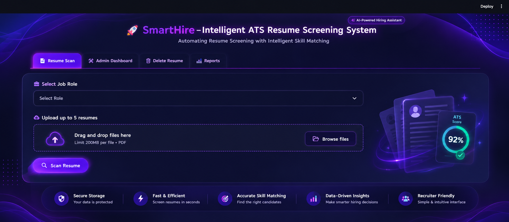

  

<h1 align="center">🚀 SmartHire – Intelligent ATS Resume Screening System</h1>

A web-based Applicant Tracking System (ATS) that streamlines resume screening by matching candidate skills with job requirements and generating ATS scores to support efficient candidate shortlisting.

---

### 📊 Admin Dashboard

---

### 📈 Reports

---

### 🗑 Delete Resume

